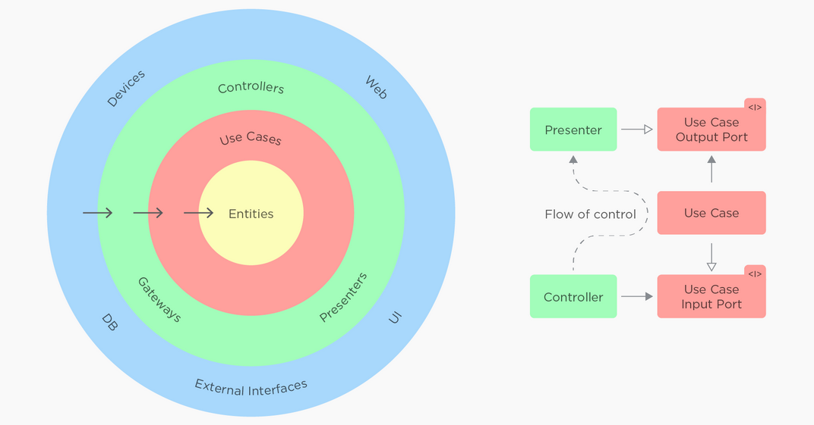

# Go Account API MongoDB

> **Account API** é um microserviço que utiliza um padrão arquitetural Clean Architecture.

## Stack

-   Golang;
-   Docker (MongoDB);

## Padrão arquitetural (Clean Architecture)

<p align="center">
    
</>

A escolha do padrão **Clean Architecture** para um projeto de software pode trazer diversos benefícios, mas é importante ressaltar que a escolha de uma arquitetura depende muito das necessidades específicas do projeto, das características da equipe de desenvolvimento e das metas a serem alcançadas.

**Principais vantagens:**

-   Separação de responsabilidades;
-   Independência de frameworks e bibliotecas;
-   Testabilidade;
-   Adaptabilidade a mudanças;
-   Escalabilidade;
-   Longevidade do software;
-   Compreensão e colaboração.

## FAQ de comandos rápidos

```bash
# Baixa um pacote específico
go get <nome_do_pacote>

# Importa todos os pacotes
go mod tidy

# Verifica as variáveis de ambiente do Go
go env

# Instala um pacote executável dentro da pasta bin
go install <nome_do_pacote>
```

## Pacotes utilizados

-   github.com/gofiber/fiber/v2
-   go.mongodb.org/mongo-driver/mongo
-   go get -u github.com/cosmtrek/air
-   go get github.com/pilu/fresh

## Como utilizar o reload com o fresh

```bash
# Instala o executável
go install github.com/pilu/fresh

# Para verificar a pasta que foi instalado
# Fica dentro da bin
echo $GOPATH
```

### Configurações do fresh

```bash
# Cria o arquivo .fresh.conf e insere o código abaixo:

root: .

command: go run main.go

build_name: main

build_log: ./tmp/main.log

log_color: true

exclude_dirs:
  - tmp
  - vendor
  - .git

include_files:
  - .go
```

### Como executar o fresh

```bash
# Apenas execute com o comando abaixo, irá carregar o arquivo de conf
fresh
```

### Configurações para o debug

```bash
# Cria o arquivo .vscode/launch.json
{
    "configurations": [
        {
            "name": "Launch",
            "type": "go",
            "request": "launch",
            "mode": "debug",
            "program": "${workspaceFolder}",
            "env": {},
            "args": []
        }
    ]
}
```

<div>
  
  <sub>Made with 💙 by <a href="https://github.com/venzel">Enéas Almeida</a></sub>
</div>
